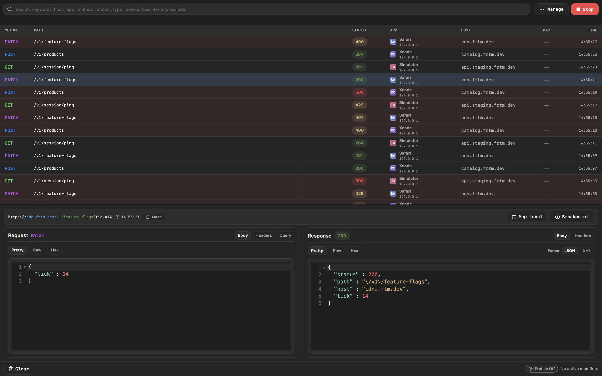
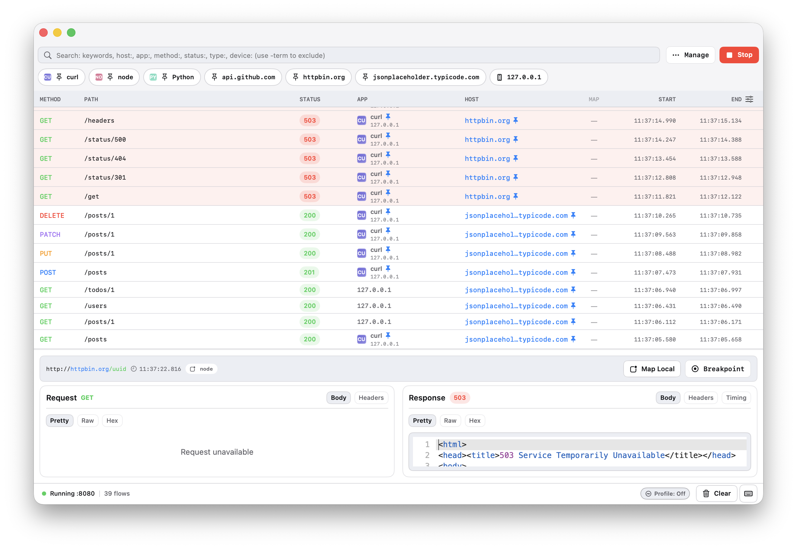
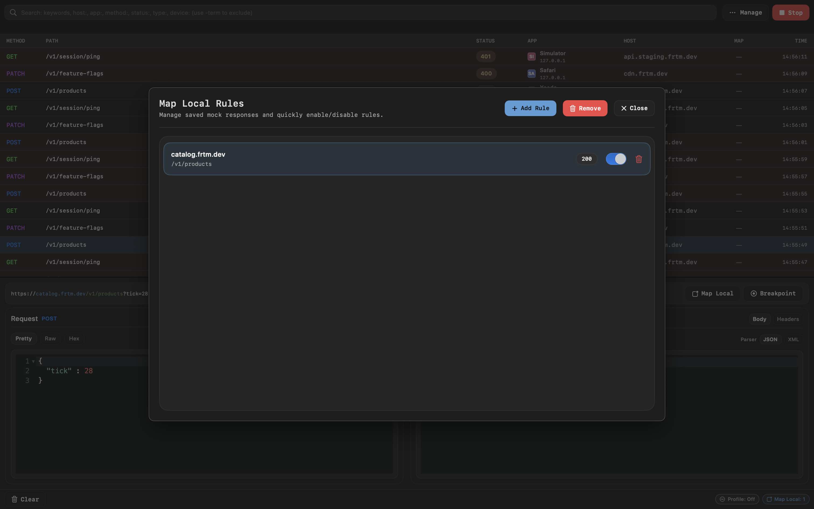
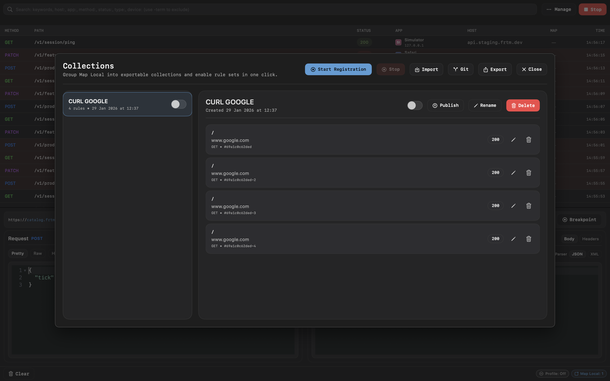
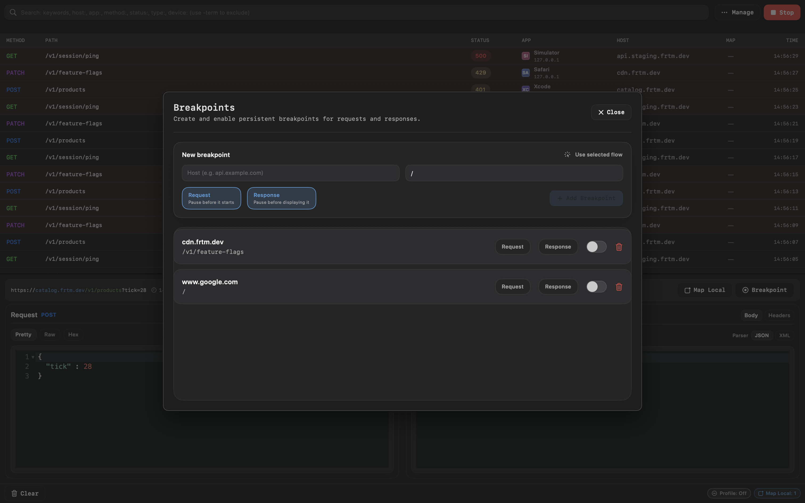

<div align="center">


# FRTMProxy

**A fast, native macOS app to inspect, mock, and reshape HTTP/S traffic in real time.**
Free forever. Public domain.

[](https://github.com/ValentinoPalomba/FRTMProxy/releases)
[](https://github.com/ValentinoPalomba/FRTMProxy/releases)
[](https://www.apple.com/macos/)
[](LICENSE)
[](https://github.com/ValentinoPalomba/FRTMProxy/stargazers)

[**Website**](https://valentinopalomba.github.io/FRTMProxy/) · [Download](https://github.com/ValentinoPalomba/FRTMProxy/releases) · [Contributing](CONTRIBUTING.md) · [Changelog](CHANGELOG.md)



</div>

---

## Why FRTMProxy

Debugging network traffic on macOS shouldn't cost $89. FRTMProxy gives you the full toolkit —
breakpoints, Map Local, scripting, diffing, WebSocket inspection, device setup — **for free, with no
limits**. It's a native SwiftUI app built on top of the battle-tested [mitmproxy](https://mitmproxy.org)
engine, so TLS interception just works.

### FRTMProxy vs Proxyman

| | **FRTMProxy** | **Proxyman — Free** | **Proxyman — Paid** |
|---|:---:|:---:|:---:|
| **Price** | **Free forever** | Free | from **$89** |
| Debugging / rewrite rules | ✅ Unlimited | ⚠️ 1 rule | ✅ |
| Breakpoints | ✅ | ❌ | ✅ |
| Map Local | ✅ | ❌ | ✅ |
| Scripting | ✅ | ❌ | ✅ |
| Request/response Diff | ✅ | ❌ | ✅ |
| WebSocket inspection | ✅ | ❌ | ✅ |
| iOS & Android setup | ✅ | ❌ | ✅ (Personal, $99) |
| HAR import / export | ✅ | ❌ | ✅ |
| Native macOS (SwiftUI) | ✅ | ✅ | ✅ |
| Open / public domain | ✅ | ❌ | ❌ |

<sub>Proxyman feature availability and pricing per [proxyman.com/pricing](https://proxyman.com/pricing), as of July 2026. Proxyman is a great, more mature tool — this table is about what you get for free.</sub>

---

## Install

### Homebrew (recommended)

```bash
brew tap ValentinoPalomba/frtmtools
brew install --cask frtmproxy
```

### Direct download

Grab the latest `.zip` from the [Releases](https://github.com/ValentinoPalomba/FRTMProxy/releases)
page. The app is signed with a Developer ID, notarized, and auto-updates via
[Sparkle](https://sparkle-project.org).

---

## What you can do

- **Inspect** requests and responses with a fast, readable inspector.
- **Mock** local responses with no code — perfect for edge cases and isolating from backends.
- **Record & replay** sessions: capture traffic, export to **HAR**, replay recorded responses as mocks.
- **Break** on requests/responses to inspect or edit them on the fly.
- **Connect devices**: guided certificate setup for iOS simulators, physical devices (via QR), and Android.
- **Capture this Mac's traffic** with a one-toggle system proxy override.
- **Shape traffic**: simulate latency, jitter, bandwidth limits, and packet loss.

### Key tools

**Rules** — answer specific requests locally. Fast mocks, edge cases, dependency isolation.

**Collections** — record a session, keep it local or push it to a Git repo. Export to HAR, edit,
reuse. Enable a collection to enter **Replay** mode: matching calls are served from recorded mocks.

**Breakpoints** — pause requests/responses to inspect or modify them before they continue.

**Device setup** — a dedicated section to connect iOS/Android: guided simulator install and a QR
code to install the certificate on a physical device.

---

## Screenshots

### Inspector

| Light | Dark |
| --- | --- |
|  |  |

### Rules



### Collections



### Breakpoints



---

## Contributing

FRTMProxy is public domain and contributions are welcome. See [CONTRIBUTING.md](CONTRIBUTING.md) to
get started (`make bootstrap`, `make build`, `make test`). Maintainer release notes live in
[docs/RELEASING.md](docs/RELEASING.md).

## Support

FRTMProxy is free and will stay free. If it saves you time, a ⭐ on the repo genuinely helps it reach
more developers — and if you'd like to say thanks, you can buy me a coffee.

[](https://www.buymeacoffee.com/fratm)

## License

Released into the **public domain** under the [Unlicense](LICENSE). Do whatever you want with it.

Happy debugging! 🚀
