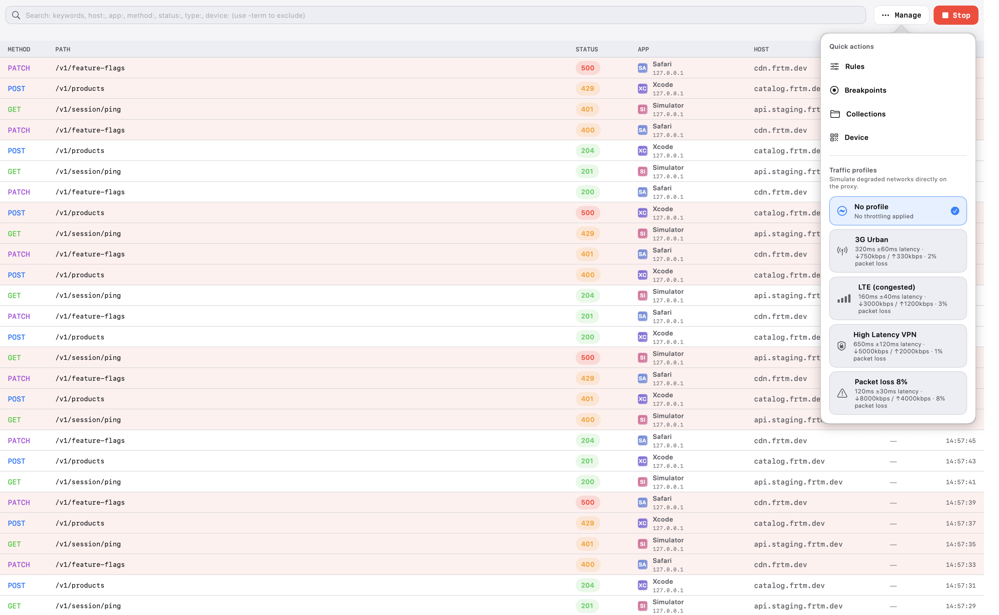

# FRTMProxy

FRTMProxy is a macOS app to observe, understand, and shape HTTP/S traffic in real time. It’s built for daily debugging, with tools that organize requests, make mocking easy, and help you replay real-world scenarios in a few clicks.

FRTMProxy is free for every developer, and it will remain free.


---

## Install

### Homebrew (recommended)

```bash
brew tap ValentinoPalomba/frtmtools
brew install --cask frtmproxy
```

### Direct download

You can also download the latest `.zip` from the [GitHub Releases](https://github.com/ValentinoPalomba/FRTMProxy/releases) page.

---

## What you can do

- **Inspect** requests and responses with a fast, readable inspector.
- **Mock** local responses in a controlled way (no code required).
- **Record sessions** and reuse them for replay and testing.
- **Pause traffic** with breakpoints to inspect or edit on the fly.
- **Connect iOS devices** with guided certificate setup.

---

## Key tools

### Rules
Define rules to answer specific requests locally. Perfect for fast mocks, edge cases, or isolating the app from external dependencies.

### Collections
Record a session, keep it locally or push it to a Git repo. You can export to **HAR**, edit it, and reuse it. When a collection is enabled, you enter **Replay** mode: when the app makes the same calls, FRTMProxy responds with the previously recorded mock services.

### Breakpoints
Pause requests/responses to inspect or modify them before letting them continue.

### Device (iOS)
A dedicated section to connect iOS devices:
- **Simulator**: guided certificate installation.
- **Physical device**: QR code to download the certificate directly on the phone.

---

## UI Preview

### Inspector

| Light | Dark |
| --- | --- |
|  |  |

### Rules


### Collections


### Breakpoints


### Actions



Happy debugging! 🚀

---

## Sparkle Release Automation

Use the helper script to build a Release app, zip it, regenerate `appcast.xml`, and publish artifacts to `gh-pages`:

```bash
./scripts/publish_sparkle_release.sh
```

Useful variants:

```bash
# Generate zip + appcast locally only (no push)
./scripts/publish_sparkle_release.sh --no-publish

# Reuse existing Release build output
./scripts/publish_sparkle_release.sh --skip-build
```

---

## Homebrew Cask Update (manual release flow)

After publishing a GitHub Release manually, update only the Homebrew cask metadata (`version`, `sha256`, `url`) with:

```bash
./scripts/update_homebrew_cask.sh \
  --version 1.6.0 \
  --tag v.1.6.0 \
  --tap-dir ~/Repositories/homebrew-frtmtools
```

Optional automation for the tap repository:

```bash
# commit in tap repo
./scripts/update_homebrew_cask.sh --version 1.6.0 --tag v.1.6.0 --tap-dir ~/Repositories/homebrew-frtmtools --commit

# commit + push in tap repo
./scripts/update_homebrew_cask.sh --version 1.6.0 --tag v.1.6.0 --tap-dir ~/Repositories/homebrew-frtmtools --push
```
